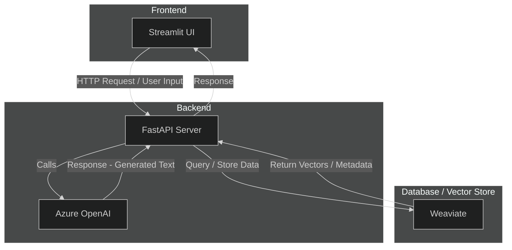

# [AZ OpenAI] AzDocRAG Demo — Document-based RAG Model Platform

> A lightweight demo platform for document-based **Retrieval-Augmented Generation (RAG)** using **Azure OpenAI**, **LangChain**, and **Weaviate**.

**AzDocRAG Demo** is an experimental platform that demonstrates how to:

- Embed and index text documents into a **vector database (Weaviate)**
- Retrieve relevant chunks for user queries
- Generate contextual responses using **Azure OpenAI** or **OpenAI** models
- Run end-to-end document Q&A via **FastAPI backend** and optional frontend

> [!NOTE]
> Built with Azure OpenAI by default, but also works with your own OpenAI key. Easily switch between local Weaviate, cloud vector DBs, MongoDB, or CosmosDB — your setup, your choice.

## Architecture



### Development

#### Dependencies

**Python version:** 3.11
**Backend:** FastAPI
**Frontend:** Streamlit

```bash
# If not exists miniconda env
conda create -n rag python=3.11

# Run the environment
conda activate rag

# Initialize setup
pip install -r requirements.txt
```

#### Weaviate (VectorDB)

```sh
# In root directory:
docker compose up -d
```

#### FastAPI

```sh
# Development
cd ./backend/src
python main.py

# Local
uvicorn main:app --reload
```

#### Streamlit

```sh
cd ./frontend/src
streamlit run app.py
```

## Contact

Email: histigma01@gmail.com
