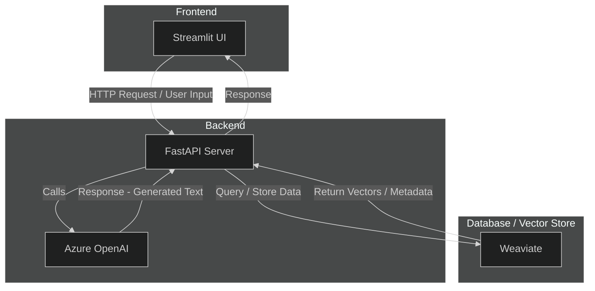
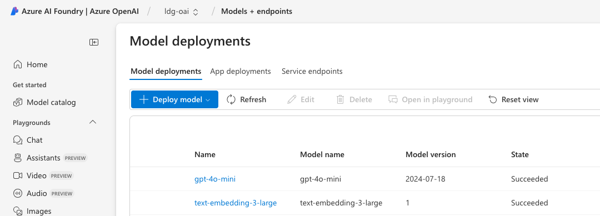
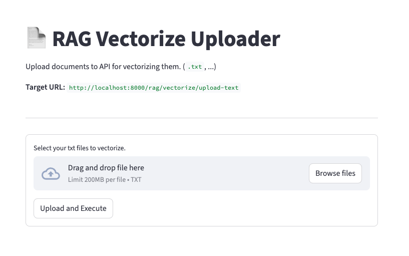
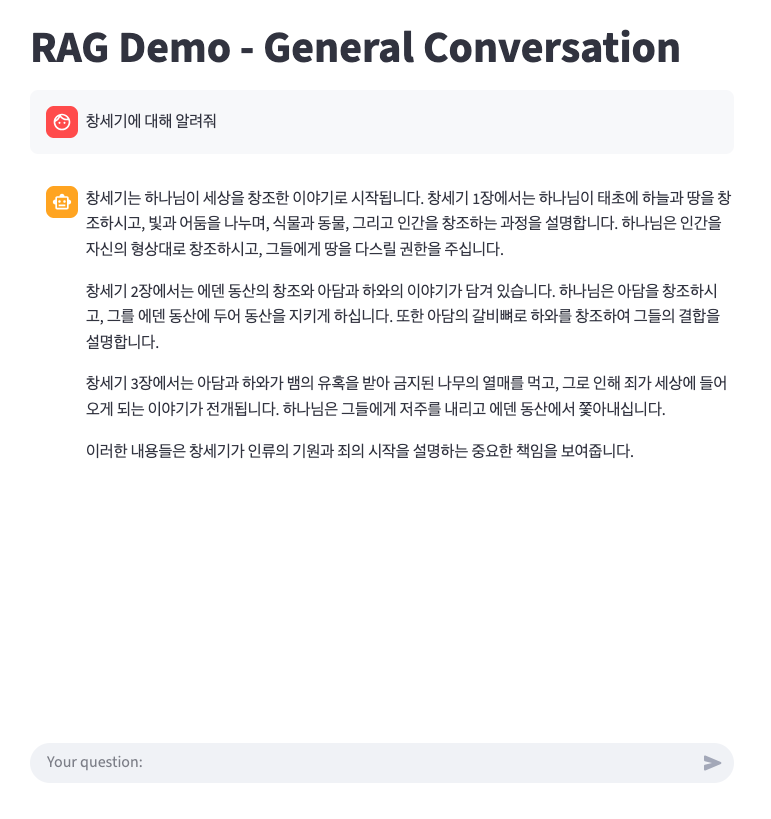

# [AZ OpenAI] AzDocRAG Demo — Document-based RAG Model Platform

> A lightweight demo platform for document-based **Retrieval-Augmented Generation (RAG)** using **Azure OpenAI**, **LangChain**, and **Weaviate**.

**AzDocRAG Demo** is an experimental platform that demonstrates how to:

- Embed and index text documents into a **vector database (Weaviate)**
- Retrieve relevant chunks for user queries
- Generate contextual responses using **Azure OpenAI** or **OpenAI** models
- Run end-to-end document Q&A via **FastAPI backend** and optional frontend

## Overview

> [!NOTE]
> Built with Azure OpenAI by default, but also works with your own OpenAI key. Easily switch between local Weaviate, cloud vector DBs, MongoDB, or CosmosDB — your setup, your choice.



**You must have OpenAI, and Azure OpenAI is also acceptable, as shown in the image below.**  


**Supports RAG functionality for documents saved for testing purposes.**




## Development

### Dependencies

**Python version:** 3.11
**Backend:** FastAPI
**Frontend:** Streamlit

### Conda (env)

```bash
# If not exists miniconda env
conda create -n rag python=3.11

# Run the environment
conda activate rag

# Initialize setup
pip install -r requirements.txt
```

### Quickly run a demo

#### Prepare OpenAI and configure the `.env` file

You must enter your OpenAI key, model, and other required information in `.env`.  
The `.env` environment file for the backend must be located within `backend/src`.  
If you want to use an Azure OpenAI, sets `AZURE_*` environment, too.  

> [!WARNING]
> The current service code only supports Azure OpenAI. For the standard OpenAI API, you must make changes directly within the service and Route.

```ini
AZURE_OPENAI_ENDPOINT=https://<Your-OpenAI_Resource-Name>.openai.azure.com/
AZURE_OPENAI_API_KEY=input-openai-api-key
OPENAI_KEY=input-openai-api-key
OPENAI_API_VERSION=20xx-01-01-preview
OPENAI_GPT_MODEL=gpt-4o-mini--type-your-gpt-model-name
OPENAI_EMBEDDINGS_DEPLOYMENT=text-embedding-3-large--type-your-deployment-name
```

> [!IMPORTANT]
> A text embedding model is also required for vectorizing sentences.  

#### Start with `make up`

```sh
make up     # up docker, fast-api, streamlit

# Stop
make down
```

### Weaviate (VectorDB)

```sh
# In root directory:
docker compose up -d
```

### FastAPI

```sh
# Development
cd ./backend/src
python main.py

# Local
uvicorn main:app --reload
```

### Streamlit

```sh
cd ./frontend/src
streamlit run app.py
```

## Contact

Email: `histigma01@gmail.com`
