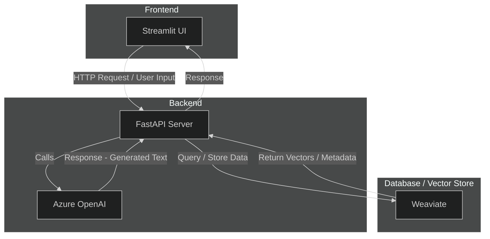

# A Stock RAG model using Azure Open AI

Created by histigma

## Architecture



### Development

#### Dependencies

Python version: 3.11
Backend: FastAPI
Frontend: Streamlit

```bash
# If not exists miniconda env
conda create -n rag python=3.11

# Run the environment
conda activate rag

# Initialize setup
pip install -r requirements.txt
```

#### Weaviate (VectorDB)

```sh
# In root directory:
docker compose up -d
```

#### FastAPI

```sh
# Development
cd ./backend/src
python main.py

# Local
uvicorn main:app --reload
```

#### Streamlit

```sh
cd ./frontend/src
streamlit run app.py
```

## Contact

Email: histigma01@gmail.com
